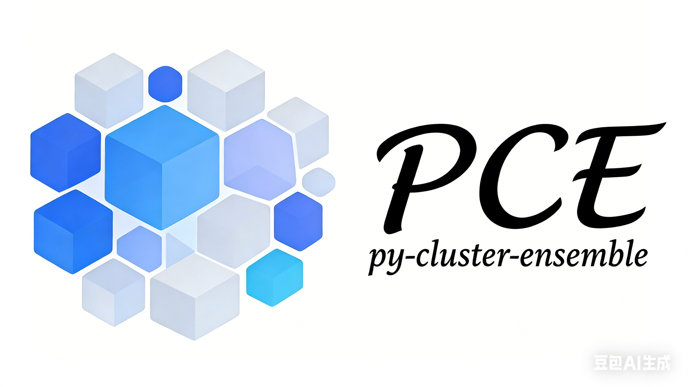

Welcome to PCE documentation!
=======================================

.. attention::

   **PRE-RELEASE DOCUMENTATION**
   This toolkit (PCE) is currently under active development for academic submission.
   The API is unstable and subject to change without notice.
   Please do not cite or use this version for production.

**PCE: py-cluster-ensemble** is a comprehensive Python toolkit for cluster ensemble
generation, consensus, and automated experimentation, specifically designed for
researchers and the academic community.

.. toctree::
   :maxdepth: 2
   :caption: Getting Started

   start/introduction
   start/installation
   start/quick_start

.. toctree::
   :maxdepth: 2
   :caption: User Guide

   guide/matlab_migration
   guide/generation_strategies
   guide/consensus_algorithms
   guide/evaluation_metrics

.. toctree::
   :maxdepth: 2
   :caption: API

   api/api

.. toctree::
   :maxdepth: 2
   :caption: Examples

   examples/base_clustering_generation
   examples/batch_processing
   examples/grid_search_optimization
   examples/visualization_gallery
   examples/domain_applications

Repository
----------

You can find the project repository at the following link: `PCE repository on GitHub <https://github.com/WenjunHe-ML/py-cluster-ensemble>`_.
